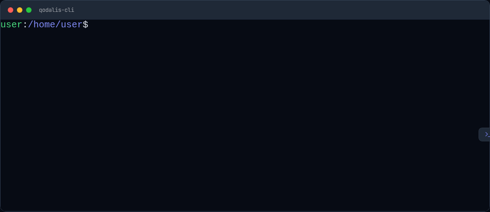

<h2 align="center">
    Qodalis Angular Web CLI
</h2>

<div align="center">

[](https://www.npmjs.com/package/@qodalis/angular-cli)
[](https://github.com/qodalis-solutions/angular-web-cli/actions)

</div>

**Qodalis Angular CLI** is a web-based terminal CLI component for Angular applications. It provides a powerful and extensible interface to execute commands and streamline workflows directly within your web application. The CLI can be extended with custom command processors to suit your specific needs.

---

## Features

- **Web-Based Terminal**: A terminal interface integrated into your Angular applications.
- **Custom Command Processors**: Easily extend functionality by creating custom command processors.
- **Lightweight and Flexible**: Designed to work seamlessly with your existing Angular project.
- **Interactive Interface**: Enables command execution and response handling in a terminal-like UI.
- **Extensibility**: The CLI is designed with extensibility in mind, allowing you to enhance its functionality through custom extensions. These extensions can be installed directly from npm and seamlessly integrated into your Angular project by adding them to the imports array in your Angular module.
- **Package Installation Support**: The CLI allows you to install packages directly from the terminal using the packages add <package> command. This streamlined approach enables you to quickly add dependencies without leaving your terminal, enhancing productivity and simplifying package management.
- **Logical operators**: Our CLI supports the use of logical operators `&&` and `||`, allowing you to combine multiple commands in a single execution, similar to how they work in Unix-like shells or scripting environments. This feature enhances productivity by chaining commands with conditional logic.

---

## Live Example

Check out a live example of the Qodalis Angular CLI on [StackBlitz](https://stackblitz.com/edit/stackblitz-qodalis-cli-example)

## Docs

Cli docs [link](https://cli-docs.qodalis.com/)

## Installation

Install the package using npm:

```bash
npm install @qodalis/angular-cli
```

## Usage



After installing, you can integrate the CLI component into your Angular application:

## Basic Setup

1. Import the CLI Module:

```typescript
import { CliModule } from "@qodalis/angular-cli";

@NgModule({
  imports: [CliModule, Cli***Module],
})
export class AppModule {}
```

2. Set the styles in the **angular.json**

```json
{
  "projects": {
    "your-project": {
      "architect": {
        "options": {
          "styles": ["node_modules/@qodalis/angular-cli/src/assets/styles.sass"]
        }
      }
    }
  }
}
```

3. Add the CLI Component to Your Template:

```html
<!-- 
    Show a terminal
 -->
<cli [options]="cliOptions" />

<!-- 
    Show a terminal wrapped in a container that is located at the bottom of the page and can be collapsed/expanded
 -->
<cli-panel />
```

4. Configure the CLI:

```typescript
cliOptions = {
  welcomeMessage: {
    message: "-- your custom welcome message --",
    show: "daily", //never, once
  },
  usersModule: {
    enabled: true,
  },
};
```

## Example Commands

### Built-in Commands

### System

- **help**: Displays available commands and their descriptions.
- **clear**: Clears the terminal screen.
- **echo \<message\>**: Prints the provided message to the terminal.
- **ping**: Pings the server
- **theme**: Interact with the cli theme
- **history**: Prints the command history of the current session
- **version**: Prints the version information
- **eval**: Evaluate a JavaScript expression
- **packages**: Manage packages in the cli

### Users

- **whoami**: Display current user information
- **su**: Switch user
- **adduser**: Add a new user
- **listusers**: List all users

### Custom

See the available packages section.

## Package Installation Support

The CLI allows you to install packages directly from the terminal using the packages add <package> command. This streamlined approach enables you to quickly add dependencies without leaving your terminal, enhancing productivity and simplifying package management.

- Installs the specified package seamlessly.
- Automatically resolves dependencies and integrates the package into cli.
- Display results in a structured format.

### Usage


### Add a package

To add a package, use the packages add command:

```bash
root:~$ packages add <package-name1> <package-name2> <package-namen>
```

Example:

```bash
root:~$ packages add guid
root:~$ packages add regex
root:~$ packages add string
root:~$ packages add curl
root:~$ packages add <any npm package that support umd>
```

This command downloads and makes the package available for evaluation.

### Remove a package

Remove a package using the `packages remove` command:

```bash
root:~$ packages remove guid
```

### Update a package

Update a package using the `packages update` command:

```bash
root:~$ packages update guid # update 1 package

root:~$ packages update guid todo # update 2 packages

root:~$ packages update # update all packages
```

### Example with guid package

```bash
packages add guid
guid new # output a19a7be4-8818-41b2-b0c2-1c82f8c21826
guid new -c # copy to the clipboard
guid new --count=3 # output 3 guid's
```

### Example with a npm package

```bash
root:~$ packages add lodash
root:~$ eval _.map([1, 2, 3, 4, 5], (n) => n * 2);
Output:
[
  2,
  4,
  6,
  8,
  10
]
root:~$
```

## Available packages

- [@qodalis/cli-guid](https://www.npmjs.com/package/@qodalis/cli-guid) - utility for guid
- [@qodalis/cli-server-logs](https://www.npmjs.com/package/@qodalis/cli-server-logs) - utility for live server logs
- [@qodalis/cli-text-to-image](https://www.npmjs.com/package/@qodalis/cli-text-to-image) - utility to generate images from text
- [@qodalis/cli-regex](https://www.npmjs.com/package/@qodalis/cli-regex) - provide utilities for working with regular expressions
- [@qodalis/cli-speed-test](https://www.npmjs.com/package/@qodalis/cli-speed-test) - run the internet speed test
- [@qodalis/cli-browser-storage](https://www.npmjs.com/package/@qodalis/cli-browser-storage) - provide commands to operate with browser storage like cookie, localStorage etc.
- [@qodalis/cli-string](https://www.npmjs.com/package/@qodalis/cli-browser-storage) - provide commands to operate with strings.
- [@qodalis/cli-curl](https://www.npmjs.com/package/@qodalis/cli-curl) - A command-line tool to execute HTTP requests on your server. Supports GET, POST, PUT, DELETE, headers, and body data.
- [@qodalis/cli-todo](https://www.npmjs.com/package/@qodalis/cli-todo) - A command-line tool for managing your tasks efficiently. Add, list, complete, and remove TODO items with simple commands.
- More will be implemented ...

## Extending with Custom Commands

You can extend the CLI by creating a class that implements the ICliCommandProcessor interface. This allows you to define new commands and their behavior.

### Creating a Custom Command Processor

1. Create a new class that extends `ICliCommandProcessor`:

```typescript
import { ICliCommandProcessor, CliProcessCommand, ICliExecutionContext } from "@qodalis/angular-cli";

export class MyCustomCommandProcessor implements ICliCommandProcessor {
  command = "greet";
  description = "Greet the user with a custom message";
  allowUnlistedCommands = true;

  async processCommand(command: CliProcessCommand, context: ICliExecutionContext): Promise<void> {
    const name = command.value;
    const message = name ? `Hello, ${name}!` : "Hello!";
    context.writer.writeln(message);
  }
}
```

2. Register the command processor:

```typescript
import { CliModule, resolveCommandProcessorProvider } from "@qodalis/angular-cli";

@NgModule({
  imports: [CliModule],
  providers: [resolveCommandProcessorProvider(MyCustomCommandProcessor)],
})
export class AppModule {}
```

### Custom Command Example

After registering **MyCustomCommandProcessor**, you can use the following command:

```bash
greet John
```

Output:

```bash
Hello, John!
```

## Extensibility

The CLI is designed with extensibility in mind, allowing you to enhance its functionality through custom extensions. These extensions can be installed directly from npm and seamlessly integrated into your Angular project by adding them to the imports array in your Angular module.

How It Works:

1. Install the extension from npm:

```bash
npm install @qodalis/cli-extension-name
```

2. Import and add it to your Angular module:

```typescript
import { ExtensionModule } from "@qodalis/cli-extension-name";

@NgModule({
  imports: [
    CliModule,
    ExtensionModule,
    // other imports
  ],
})
export class AppModule {}
```

Benefits:

- Easily extend the CLI with new commands or features.
- Leverage the rich ecosystem of npm packages to customize your workflow.
- Keep your CLI lightweight while enabling project-specific functionality through extensions.
- This flexibility ensures the CLI adapts to your project's needs, fostering scalability and customization.

## Logical operators

- These logical operators rely on the exit codes of commands:

  - `0` indicates success.
  - Non-zero values indicate failure.

- Commands are executed sequentially in the order specified.
- Logical operators provide flexibility to handle conditional execution efficiently in automation scripts or complex workflows.

```bash
# Example with &&
packages add guid && echo Package installed

# Example with ||
packages add invalid-package || echo Package not installed
```

## Contributing

We welcome contributions! To contribute:

1. Fork this repository.
2. Create a branch for your feature or bugfix.
3. Submit a pull request.

Please ensure all contributions follow the project coding standards.

## License

This project is licensed under the MIT License. See the **LICENSE** file for details.

```vbnet

You can copy this content into a file named `README.md` in your project directory. Let me know if there's anything else you'd like to adjust! 🚀
```
