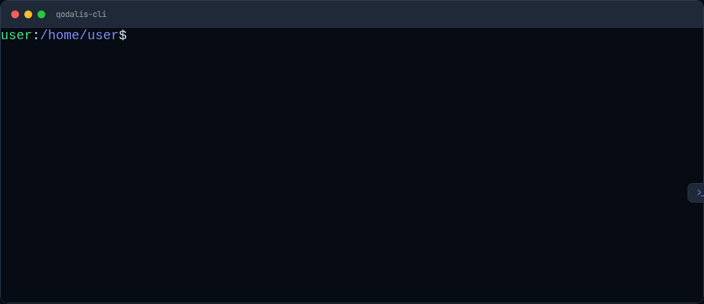

<h1 align="center">Qodalis Web CLI</h1>

<p align="center">A web-based terminal for Angular, React, and Vue — extensible, themeable, and packed with built-in developer tools.</p>

<div align="center">

[](https://www.npmjs.com/package/@qodalis/cli)
[](https://www.npmjs.com/package/@qodalis/angular-cli)
[](https://www.npmjs.com/package/@qodalis/react-cli)
[](https://www.npmjs.com/package/@qodalis/vue-cli)
[](https://github.com/qodalis-solutions/web-cli/actions)
[](https://opensource.org/licenses/MIT)

</div>

<p align="center">
  <a href="https://cli.qodalis.com/">Live Demo</a> &middot;
  <a href="https://cli.qodalis.com/docs/">Documentation</a> &middot;
  <a href="https://www.npmjs.com/package/@qodalis/cli">npm</a>
</p>

---

## Try It Online

| Framework | StackBlitz | CodeSandbox | Gitpod |
|-----------|------------|-------------|--------|
| **Angular** | [](https://stackblitz.com/github/qodalis-solutions/qodalis-cli-angular-example) | [](https://codesandbox.io/p/github/qodalis-solutions/qodalis-cli-angular-example) | [](https://gitpod.io/#https://github.com/qodalis-solutions/qodalis-cli-angular-example) |
| **React** | [](https://stackblitz.com/github/qodalis-solutions/qodalis-cli-react-example) | [](https://codesandbox.io/p/github/qodalis-solutions/qodalis-cli-react-example) | [](https://gitpod.io/#https://github.com/qodalis-solutions/qodalis-cli-react-example) |
| **Vue** | [](https://stackblitz.com/github/qodalis-solutions/qodalis-cli-vue-example) | [](https://codesandbox.io/p/github/qodalis-solutions/qodalis-cli-vue-example) | [](https://gitpod.io/#https://github.com/qodalis-solutions/qodalis-cli-vue-example) |
| **Vanilla** | [](https://stackblitz.com/github/qodalis-solutions/qodalis-cli-vanilla-example) | [](https://codesandbox.io/p/github/qodalis-solutions/qodalis-cli-vanilla-example) | [](https://gitpod.io/#https://github.com/qodalis-solutions/qodalis-cli-vanilla-example) |

---



## Packages

| Package | Description |
|---------|-------------|
| [`@qodalis/cli-core`](https://www.npmjs.com/package/@qodalis/cli-core) | Shared interfaces, models, and types |
| [`@qodalis/cli`](https://www.npmjs.com/package/@qodalis/cli) | Framework-agnostic terminal engine (50+ built-in commands) |
| [`@qodalis/angular-cli`](https://www.npmjs.com/package/@qodalis/angular-cli) | Angular wrapper |
| [`@qodalis/react-cli`](https://www.npmjs.com/package/@qodalis/react-cli) | React wrapper |
| [`@qodalis/vue-cli`](https://www.npmjs.com/package/@qodalis/vue-cli) | Vue 3 wrapper |

## Quick Start

### Angular

```bash
npm install @qodalis/angular-cli
```

```typescript
import { CliModule } from '@qodalis/angular-cli';

@NgModule({
  imports: [CliModule],
})
export class AppModule {}
```

Add styles to `angular.json`:

```json
{
  "styles": [
    "node_modules/@qodalis/angular-cli/src/assets/styles.sass"
  ]
}
```

```html
<!-- Full terminal -->
<cli [options]="cliOptions" />

<!-- Collapsible panel -->
<cli-panel />
```

### React

```bash
npm install @qodalis/react-cli
```

```tsx
import { Cli } from '@qodalis/react-cli';

function App() {
  return <Cli style={{ width: '100vw', height: '100vh' }} />;
}
```

### Vue

```bash
npm install @qodalis/vue-cli
```

```vue
<script setup lang="ts">
import { Cli } from '@qodalis/vue-cli';
</script>

<template>
  <Cli :style="{ width: '100vw', height: '100vh' }" />
</template>
```

### Configuration (all frameworks)

Pass options to customize the terminal:

```typescript
const options = {
  welcomeMessage: {
    message: '-- your custom welcome message --',
    show: 'daily', // 'never', 'once', 'daily', 'always'
  },
  usersModule: {
    enabled: true,
  },
};
```

## Built-in Commands

### System

| Command | Aliases | Description |
|---------|---------|-------------|
| `help` | `man` | Show all commands or help for a specific command |
| `version` | `ver` | Display CLI version and documentation link |
| `hotkeys` | `shortcuts`, `keys` | Show keyboard shortcuts |
| `history` | `hist` | Browse and clear command history |
| `theme` | `themes` | Apply, customize, and save terminal themes (interactive selection with live preview) |
| `feedback` | `support` | Report bugs or request features on GitHub |
| `pkg` | `packages` | Install, update, remove, and browse packages |

### Utilities

| Command | Aliases | Description |
|---------|---------|-------------|
| `clear` | `cls` | Clear the terminal (or `Ctrl+L`) |
| `echo` | `print` | Print text to the terminal |
| `eval` | `calc`, `js` | Evaluate JavaScript expressions |
| `sleep` | `wait` | Pause execution for N milliseconds |
| `time` | `date` | Show current local and UTC time |
| `uptime` | — | Show session uptime |
| `uname` | `sysinfo` | System and browser information |
| `screen` | `display` | Screen, viewport, and terminal dimensions |
| `open` | — | Open a URL in a new browser tab |
| `alias` / `unalias` | — | Create and remove command aliases |
| `yes` | — | Output a string repeatedly |
| `seq` | `sequence` | Print number sequences |
| `cal` | `calendar` | Display a monthly calendar |

### Developer Tools

| Command | Aliases | Description |
|---------|---------|-------------|
| `base64` | `b64` | Encode / decode Base64 |
| `json` | — | Format, minify, and validate JSON |
| `url` | — | Encode, decode, and parse URLs |
| `jwt` | — | Decode and inspect JWT tokens |
| `hash` | — | SHA-256, SHA-1, SHA-384, SHA-512 hashes |
| `hex` | — | Hex encode/decode and base conversion (2-36) |
| `color` | `colour` | Convert between hex, rgb, hsl with preview |
| `random` | `rand` | Random numbers, strings, UUIDs, coin flip, dice |
| `lorem` | `lipsum` | Generate placeholder text |
| `timestamp` | `ts`, `epoch` | Convert between Unix timestamps and dates |
| `convert` | `conv` | Unit conversion (length, weight, temperature, data) |
| `clipboard` | `cb`, `pbcopy` | Copy to / paste from clipboard |

### Users

| Command | Aliases | Description |
|---------|---------|-------------|
| `whoami` | `me` | Display current user |
| `su` | `switch-user` | Switch user session |
| `adduser` | `useradd` | Add a new user |
| `listusers` | `users` | List all users |

## Package Manager

Install additional commands at runtime from npm — no rebuild needed.


```bash
pkg browse                     # Browse available packages
pkg add guid                   # Install a package
pkg remove guid                # Remove a package
pkg update                     # Update all packages
pkg update guid@1.0.2          # Pin a specific version
pkg check                      # Check for updates
pkg versions guid              # Show all published versions
pkg source set                 # Interactively select a package source (CDN)
pkg source set unpkg           # Set package source directly
```

### Available Packages

| Package | Command | Description |
|---------|---------|-------------|
| [@qodalis/cli-guid](https://www.npmjs.com/package/@qodalis/cli-guid) | `guid` | Generate and validate UUIDs |
| [@qodalis/cli-string](https://www.npmjs.com/package/@qodalis/cli-string) | `string` | String manipulation (case, trim, reverse, slug, wc, etc.) |
| [@qodalis/cli-curl](https://www.npmjs.com/package/@qodalis/cli-curl) | `curl` | HTTP requests (GET, POST, PUT, DELETE) |
| [@qodalis/cli-todo](https://www.npmjs.com/package/@qodalis/cli-todo) | `todo` | Task management |
| [@qodalis/cli-regex](https://www.npmjs.com/package/@qodalis/cli-regex) | `regex` | Regular expression testing |
| [@qodalis/cli-qr](https://www.npmjs.com/package/@qodalis/cli-qr) | `qr` | QR code generation |
| [@qodalis/cli-speed-test](https://www.npmjs.com/package/@qodalis/cli-speed-test) | `speed-test` | Internet speed test |
| [@qodalis/cli-server-logs](https://www.npmjs.com/package/@qodalis/cli-server-logs) | `server-logs` | Live server log streaming |
| [@qodalis/cli-browser-storage](https://www.npmjs.com/package/@qodalis/cli-browser-storage) | `local-storage`, `cookies` | Browser storage operations |
| [@qodalis/cli-text-to-image](https://www.npmjs.com/package/@qodalis/cli-text-to-image) | `text-to-image` | Generate images from text |
| [@qodalis/cli-password-generator](https://www.npmjs.com/package/@qodalis/cli-password-generator) | `generate-password` | Password generation |
| [@qodalis/cli-data-explorer](https://www.npmjs.com/package/@qodalis/cli-data-explorer) | `data-explorer` | Interactive REPL for querying SQL, MongoDB, and custom data sources |

Any npm package with UMD support can also be loaded:

```bash
pkg add lodash
eval _.map([1, 2, 3], n => n * 2)
```

## Creating a CLI Plugin

### Quick Start

Scaffold a complete plugin project with a single command:

```bash
npx @qodalis/create-cli-plugin
```

The interactive prompts will ask for:

| Prompt | Description | Example |
|--------|-------------|---------|
| **Plugin name** | Lowercase, no spaces, no `cli-` prefix (added automatically) | `weather` |
| **Description** | Short description of the plugin | `Weather forecasts` |
| **Processor class name** | PascalCase name for the command processor class | `Weather` |

You can also skip the prompts by passing arguments directly:

```bash
npx @qodalis/create-cli-plugin --name weather --description "Weather forecasts" --processor-name Weather
```

Or install globally:

```bash
npm install -g @qodalis/create-cli-plugin
create-cli-plugin
```

### Standalone vs Monorepo Mode

The tool auto-detects whether you're inside the `web-cli` monorepo:

| Mode | Detection | Output directory | Package manager |
|------|-----------|-----------------|-----------------|
| **Standalone** | Any directory outside web-cli | `./qodalis-cli-<name>/` | npm or pnpm (auto-detected) |
| **Monorepo** | Inside web-cli workspace | `packages/plugins/<name>/` | pnpm (workspace) |

In monorepo mode, the tool also:
- Creates `project.json` (Nx build + test targets)
- Creates `tsconfig.spec.json` (Karma/Jasmine test config)
- Updates `tsconfig.base.json` with the path alias `@qodalis/cli-<name>` → `dist/<name>`

### Generated Project Structure

```
qodalis-cli-weather/                    # or packages/plugins/weather/ in monorepo
  package.json                          # npm package with CJS/ESM/UMD exports
  tsup.config.ts                        # Build config (library + IIFE bundles)
  tsconfig.json                         # TypeScript config
  README.md                             # Auto-generated README
  src/
    public-api.ts                       # Public exports + ICliModule declaration
    cli-entrypoint.ts                   # IIFE entrypoint for browser runtime loading
    lib/
      version.ts                        # LIBRARY_VERSION + API_VERSION constants
      index.ts                          # Barrel re-exports
      processors/
        cli-weather-command-processor.ts # Command processor (your main logic goes here)
    tests/
      index.spec.ts                     # Jasmine test scaffold
```

### Step-by-Step Workflow

#### 1. Scaffold the plugin

```bash
npx @qodalis/create-cli-plugin --name weather
```

#### 2. Implement your command processor

Edit `src/lib/processors/cli-weather-command-processor.ts`:

```typescript
import {
    CliProcessCommand,
    DefaultLibraryAuthor,
    ICliCommandProcessor,
    ICliExecutionContext,
} from '@qodalis/cli-core';
import { LIBRARY_VERSION } from '../version';

export class CliWeatherCommandProcessor implements ICliCommandProcessor {
    command = 'weather';
    description = 'Weather forecasts';
    author = DefaultLibraryAuthor;
    version = LIBRARY_VERSION;

    // Sub-commands
    processors?: ICliCommandProcessor[] = [
        {
            command: 'forecast',
            description: 'Get weather forecast for a city',
            parameters: [
                {
                    name: 'city',
                    aliases: ['c'],
                    description: 'City name',
                    required: true,
                    type: 'string',
                },
                {
                    name: 'days',
                    aliases: ['d'],
                    description: 'Number of days',
                    required: false,
                    type: 'number',
                    defaultValue: '3',
                },
            ],
            processCommand: async (command, context) => {
                const city = command.args['city'];
                const days = parseInt(command.args['days'] ?? '3');
                context.writer.writeln(`Forecast for ${city} (${days} days):`);
                context.writer.writeSuccess('Sunny, 25°C');
            },
        },
        {
            command: 'current',
            description: 'Get current weather',
            acceptsRawInput: true,    // command.value = text after 'current'
            valueRequired: true,       // error if no value provided
            processCommand: async (command, context) => {
                context.writer.writeln(`Current weather in ${command.value}: Sunny, 25°C`);
            },
        },
    ];

    // Default handler (runs when user types just 'weather')
    async processCommand(command: CliProcessCommand, context: ICliExecutionContext): Promise<void> {
        context.executor.showHelp(command, context);
    }
}
```

#### 3. Build the plugin

**Standalone:**

```bash
cd qodalis-cli-weather
npm run build          # or: npx tsup
```

**Monorepo:**

```bash
pnpm nx build weather
```

Build output goes to `dist/weather/` with three bundles:
- `public-api.js` (CJS) + `public-api.mjs` (ESM) + `public-api.d.ts` (types)
- `umd/index.js` (IIFE — self-contained browser bundle for runtime `pkg add`)

#### 4. Test the plugin

**Standalone:** Add your preferred test runner.

**Monorepo:**

```bash
pnpm nx test weather
```

#### 5. Publish to npm

```bash
cd dist/weather         # or: cd qodalis-cli-weather/dist
npm publish --access public
```

Users can then install your plugin at runtime in any Qodalis CLI terminal:

```bash
pkg add @qodalis/cli-weather
weather forecast --city "New York"
```

### The ICliModule Export

Every plugin exports an `ICliModule` object in `public-api.ts`. This is how frameworks register your plugin:

```typescript
import { ICliModule } from '@qodalis/cli-core';
import { CliWeatherCommandProcessor } from './lib/processors/cli-weather-command-processor';
import { API_VERSION } from './lib/version';

export const weatherModule: ICliModule = {
    apiVersion: API_VERSION,         // must be >= 2
    name: '@qodalis/cli-weather',
    processors: [new CliWeatherCommandProcessor()],
};
```

`ICliModule` also supports optional lifecycle hooks and configuration:

```typescript
export const weatherModule: ICliModule = {
    apiVersion: 2,
    name: '@qodalis/cli-weather',
    processors: [new CliWeatherCommandProcessor()],
    dependencies: ['@qodalis/cli-curl'],     // boot other modules first
    priority: 0,                              // boot order (lower = first)
    configure(config) { /* ... */ return this; },
    onInit(context) { /* before processors initialize */ },
    onAfterBoot(context) { /* after all modules boot */ },
    onDestroy(context) { /* teardown */ },
};
```

### The IIFE Entrypoint

`src/cli-entrypoint.ts` enables runtime loading via `pkg add`. It calls `bootCliModule()` which registers the module with the global `window.__cliModuleRegistry`:

```typescript
import { bootCliModule, ICliModule } from '@qodalis/cli-core';
import { CliWeatherCommandProcessor } from './lib/processors/cli-weather-command-processor';
import { API_VERSION } from './lib/version';

const module: ICliModule = {
    apiVersion: API_VERSION,
    name: '@qodalis/cli-weather',
    processors: [new CliWeatherCommandProcessor()],
};

bootCliModule(module);
```

### Execution Context API

The `ICliExecutionContext` passed to `processCommand` provides:

| Property | Description |
|----------|-------------|
| `context.writer` | Terminal output — `writeln()`, `writeInfo()`, `writeSuccess()`, `writeError()`, `wrapInColor()` |
| `context.reader` | User input — `readLine()`, `readPassword()`, `readConfirm()`, `readSelect()`, `readMultiSelect()`, `readNumber()` |
| `context.executor` | Command execution — `showHelp(command, context)` |
| `context.clipboard` | Clipboard — `write()`, `read()` |
| `context.state` | Persistent key-value store |
| `context.progressBar` | Progress bar widget |
| `context.spinner` | Spinner widget |
| `context.terminal` | Raw xterm.js `Terminal` instance |
| `context.onAbort` | `Subject<void>` for Ctrl+C cancellation |
| `context.enterFullScreenMode()` | Switch to full-screen TUI mode |
| `context.createInterval()` / `context.createTimeout()` | Managed timers (auto-cleaned on abort) |

### Registering Plugins in Your App

#### Angular (via providers)

```typescript
import { CliModule, resolveCliModuleProvider } from '@qodalis/angular-cli';
import { weatherModule } from '@qodalis/cli-weather';

@NgModule({
  imports: [CliModule],
  providers: [resolveCliModuleProvider(weatherModule)],
})
export class AppModule {}
```

#### Angular (via template input)

```typescript
import { weatherModule } from '@qodalis/cli-weather';

export class AppComponent {
  modules = [weatherModule];
}
```

```html
<cli [modules]="modules" />
```

#### React

```tsx
import { CliConfigProvider, Cli } from '@qodalis/react-cli';
import { weatherModule } from '@qodalis/cli-weather';

function App() {
  return (
    <CliConfigProvider modules={[weatherModule]}>
      <Cli />
    </CliConfigProvider>
  );
}
```

#### Vue

```vue
<script setup lang="ts">
import { CliConfigProvider, Cli } from '@qodalis/vue-cli';
import { weatherModule } from '@qodalis/cli-weather';
</script>

<template>
  <CliConfigProvider :modules="[weatherModule]">
    <Cli />
  </CliConfigProvider>
</template>
```

## Data Explorer

The `@qodalis/cli-data-explorer` plugin adds an interactive, full-screen REPL for querying data sources (SQL, MongoDB, and custom providers) directly from the terminal.

### Setup

Install and register the plugin, then configure backend servers:

```typescript
import { dataExplorerModule } from '@qodalis/cli-data-explorer';

// Add to your modules array
const modules = [dataExplorerModule, /* ... other modules */];

// Configure at least one server with data explorer providers
const options: CliOptions = {
  servers: [
    { name: 'node', url: 'http://localhost:8047' },
    { name: 'dotnet', url: 'http://localhost:8046' },
    { name: 'python', url: 'http://localhost:8048' },
  ],
};
```

Or install at runtime without a rebuild:

```bash
pkg add data-explorer
```

### Usage

```bash
data-explorer
```

Select a server and data source, then enter the full-screen REPL:

```
data-explorer> SELECT * FROM users WHERE active = true;

3 rows (12ms)
┌────┬───────┬──────────────┐
│ id │ name  │ email        │
├────┼───────┼──────────────┤
│  1 │ Alice │ alice@ex.com │
│  2 │ Bob   │ bob@ex.com   │
│  3 │ Carol │ carol@ex.com │
└────┴───────┴──────────────┘

data-explorer> \format json
Output format set to: json

data-explorer> db.users.find({"age": {"$gt": 25}})
[
  { "_id": "abc", "name": "Alice", "age": 30 },
  { "_id": "def", "name": "Bob", "age": 28 }
]
```

### REPL Commands

| Command | Description |
|---------|-------------|
| `\format <table\|json\|csv\|raw>` | Switch output format |
| `\templates` | List available query templates |
| `\use <name>` | Load a template query |
| `\history` | Show query history |
| `\clear` | Clear screen |
| `\help` | Show all commands |
| `\quit` / `\q` | Exit |

Use **Up/Down arrows** for history navigation, **Escape** or **Ctrl+C** to exit.

## Extending with Inline Commands

For quick one-off commands without creating a full plugin, implement `ICliCommandProcessor` directly in your app:

```typescript
import {
  ICliCommandProcessor,
  CliProcessCommand,
  ICliExecutionContext,
} from '@qodalis/cli-core';

export class GreetCommandProcessor implements ICliCommandProcessor {
  command = 'greet';
  description = 'Greet someone by name';
  acceptsRawInput = true;
  valueRequired = true;

  async processCommand(
    command: CliProcessCommand,
    context: ICliExecutionContext,
  ): Promise<void> {
    context.writer.writeln(`Hello, ${command.value}!`);
  }
}
```

Register it with your framework (Angular: `resolveCommandProcessorProvider(GreetCommandProcessor)`, React/Vue: pass via `processors` prop), or wrap it in an inline `ICliModule`:

```typescript
const myModule: ICliModule = {
  apiVersion: 2,
  name: 'my-app-commands',
  processors: [new GreetCommandProcessor()],
};
```

```bash
~$ greet World
Hello, World!
```

## Using the Engine Directly

For advanced use cases or non-framework environments, use `CliEngine` directly:

```typescript
import { CliEngine } from '@qodalis/cli';

const engine = new CliEngine(document.getElementById('terminal')!, {
  welcomeMessage: { message: 'Welcome!', show: 'always' },
});

engine.registerProcessors([new GreetCommandProcessor()]);
await engine.start();
```

## Features

- **Multi-framework** — Angular, React, Vue, or vanilla JS
- **Command chaining** with `&&`, `||`, `|`, and `>>` operators
- **Command history** with arrow key navigation
- **Tab-like completions** and keyboard shortcuts (`Ctrl+C`, `Ctrl+L`, `Escape`)
- **Theming** with built-in themes and custom color support
- **User sessions** with multi-user support
- **State persistence** across sessions
- **Interactive prompts** with live preview (select menus with real-time feedback)
- **Full-screen mode API** for rich TUI commands
- **Progress bars, spinners, and text animations**
- **Runtime package installation** from npm

## Contributing

1. Fork this repository
2. Create a branch for your feature or bugfix
3. Submit a pull request

## License

MIT
